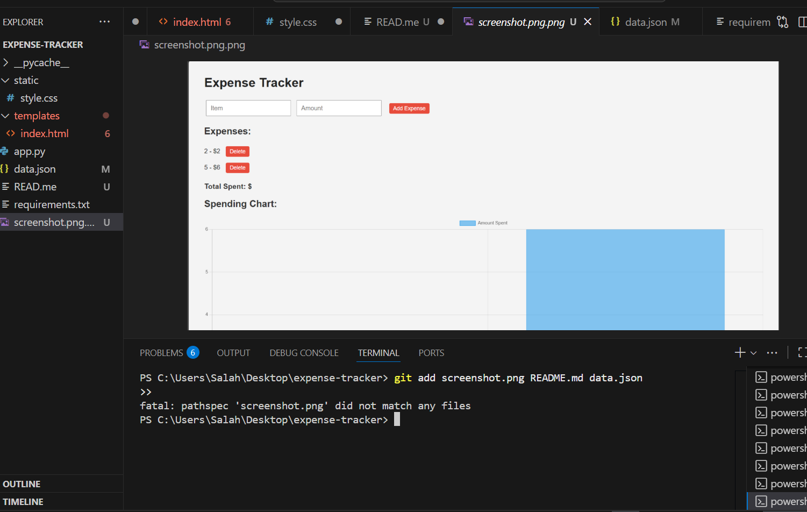

# Expense Tracker

A simple Flask-based web app to track expenses, visualize spending, and manage data.
## Preview



## Features
- Add and delete expenses
- View total spending
- Interactive spending chart (Chart.js)
- Clean and responsive design

## How to Run
```bash
pip install flask
python app.py
